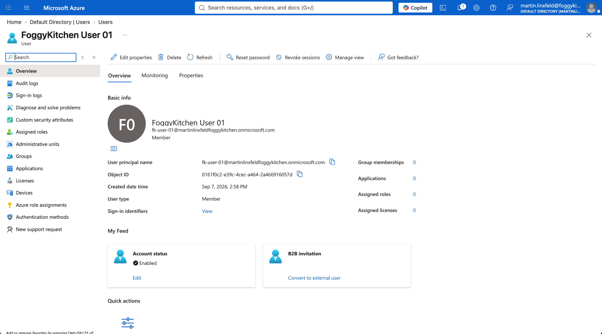

# Example 01: Microsoft Entra User

In this Microsoft Entra example, we deploy one **Microsoft Entra user** using **Terraform/OpenTofu** and the local `terraform-az-fk-entra-user` module.
The user is created with an initial password and is required to change that password at next sign-in by the module default.

This example focuses on the **minimal user deployment path**, where the user principal name, display name, mail nickname, and initial password are supplied by the caller.

---

## Architecture Overview

This deployment creates:

- One **Microsoft Entra user** using the local `terraform-az-fk-entra-user` module
- One user principal name configured through `user_principal_name`
- One display name configured through `display_name`
- One mail nickname configured through `mail_nickname`
- One initial password configured through the sensitive `password` input

This is the most direct way to understand the base module contract before composing users with Microsoft Entra groups or Azure RBAC modules.

---

## Configuration Layout

- **Example directory:** `examples/01_single_user`
- **Default display name:** `FoggyKitchen User 01`
- **Default mail nickname:** `fk-user-01`
- **Default password behavior:** password change required at next sign-in
- **Account state:** enabled by default

Microsoft Entra users are tenant-level directory objects.
They are not deployed into an Azure Resource Group and do not support Azure resource tags.

---

## Deployment Steps

Change into the example directory:

```bash
cd examples/01_single_user
```

Copy the example variables file:

```bash
cp terraform.tfvars.example terraform.tfvars
```

Update `terraform.tfvars` with a real verified Microsoft Entra domain in `user_principal_name` and a suitable initial password.

Initialize and apply the Terraform/OpenTofu configuration:

```bash
tofu init
tofu plan
tofu apply
```

After a successful deployment, OpenTofu will output:

- The Microsoft Entra user resource ID
- The Microsoft Entra user object ID
- The Microsoft Entra user principal name
- The Microsoft Entra tenant ID used by the AzureAD provider

---

## Runtime Notes

After deployment, the Microsoft Entra user should:

- be enabled
- have the configured user principal name
- have the configured display name
- have the configured mail nickname
- require password change at next sign-in by default

The identity running this example needs permission to create Microsoft Entra users in the target tenant.
Protect local state and plan files because password material can be stored in Terraform/OpenTofu state.

---

## Azure Console And Runtime Verification

### Microsoft Entra User Overview

In the Azure portal, open Microsoft Entra ID and verify that the user exists with the expected user principal name and display name.



### User Properties

Confirm that the account is enabled and that the profile fields match the Terraform/OpenTofu configuration.

### Terraform/OpenTofu Outputs

Confirm that `user_object_id`, `user_principal_name`, and `tenant_id` match the user shown in Microsoft Entra ID.

---

## Cleanup

To remove all resources created by this example:

```bash
tofu destroy
```

---

## Summary

This example demonstrates:

- How to deploy a **Microsoft Entra user** using Terraform/OpenTofu
- How to use the local `terraform-az-fk-entra-user` module with minimal required inputs
- How to retrieve the user object ID for group membership or service integration examples
- How initial password handling is represented as a sensitive Terraform/OpenTofu input

---

## Learn More

Visit [FoggyKitchen.com](https://foggykitchen.com/) for Azure, OCI, multicloud, and Terraform/OpenTofu learning resources.

---

## License

Licensed under the **Universal Permissive License (UPL), Version 1.0**.
See [LICENSE](../../LICENSE) for more details.

---

© 2026 [FoggyKitchen.com](https://foggykitchen.com) - Cloud. Code. Clarity.
