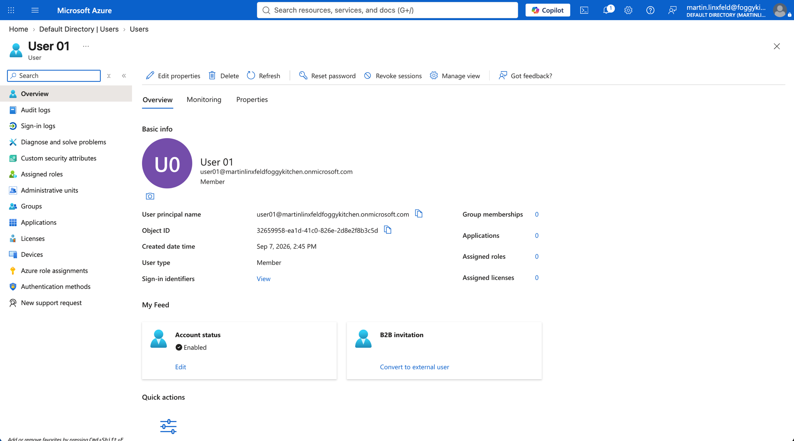
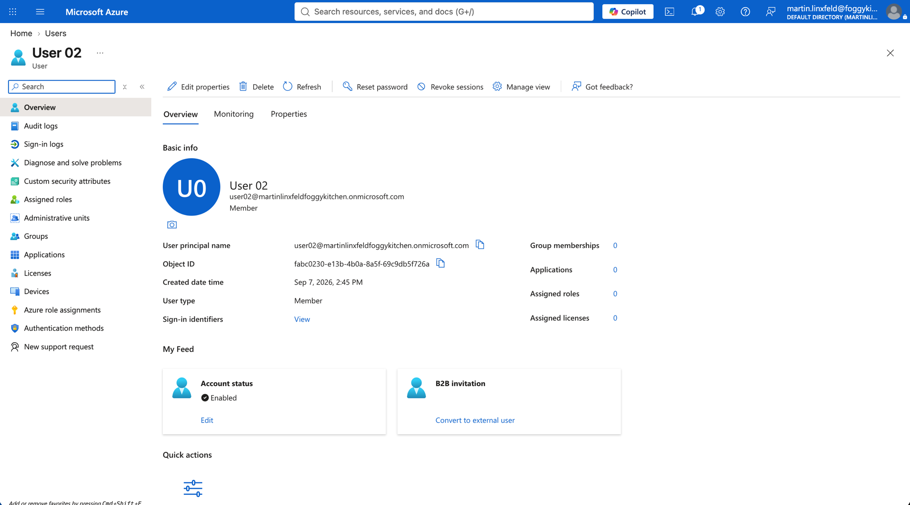
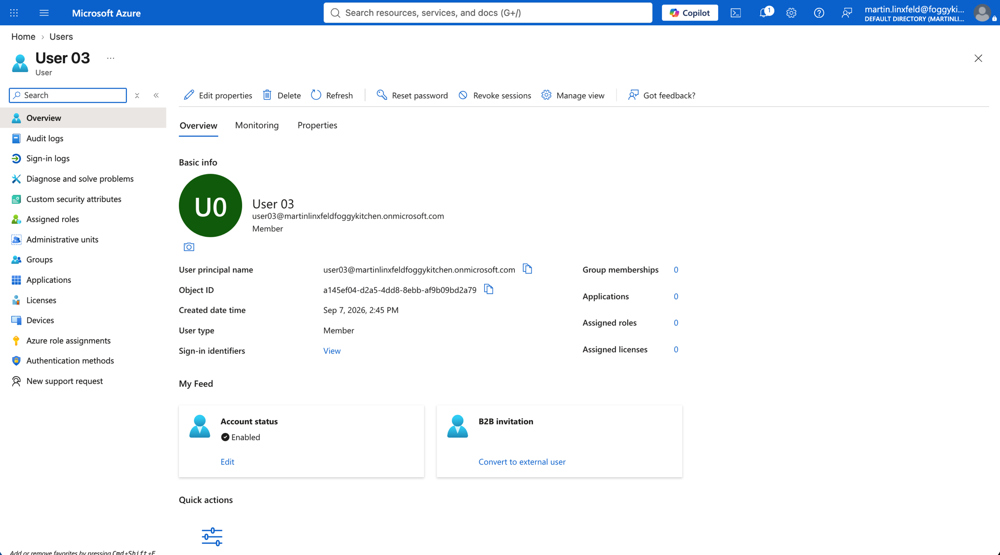

# Example 02: Multiple Microsoft Entra Users

In this Microsoft Entra example, we deploy three **Microsoft Entra users** using **Terraform/OpenTofu** and the local `terraform-az-fk-entra-user` module.
The created user object IDs are exposed as outputs so they can be passed directly into `terraform-az-fk-entra-group` as group members.

This example focuses on the **multiple user deployment path**, where a repeatable local user map creates a small set of lab users for identity composition examples.

---

## Architecture Overview

This deployment creates:

- Three **Microsoft Entra users** using the local `terraform-az-fk-entra-user` module
- User principal names based on `user_principal_name_suffix`
- Shared initial password configured through the sensitive `password` input
- Profile metadata for each example user
- A `member_object_ids` output ready for group membership examples

This is the most direct way to prepare user principals for examples that need Microsoft Entra group membership.

---

## Configuration Layout

- **Example directory:** `examples/02_multiple_users`
- **Default users:** `user01`, `user02`, `user03`
- **UPN suffix input:** `user_principal_name_suffix`
- **Default password behavior:** password change required at next sign-in
- **Account state:** enabled by default

Microsoft Entra users are tenant-level directory objects.
They are not deployed into an Azure Resource Group and do not support Azure resource tags.

---

## Deployment Steps

Change into the example directory:

```bash
cd examples/02_multiple_users
```

Copy the example variables file:

```bash
cp terraform.tfvars.example terraform.tfvars
```

Update `terraform.tfvars` with a real verified Microsoft Entra domain suffix and a suitable initial password:

```hcl
user_principal_name_suffix = "example.com"
password                   = "ChangeMe-12345!"
```

Initialize and apply the Terraform/OpenTofu configuration:

```bash
tofu init
tofu plan
tofu apply
```

After a successful deployment, OpenTofu will output:

- The Microsoft Entra user object IDs keyed by example user
- The Microsoft Entra user principal names keyed by example user
- The `member_object_ids` list ready to pass into `terraform-az-fk-entra-group`

---

## Runtime Notes

After deployment, the Microsoft Entra users should:

- be enabled
- use the configured verified domain suffix
- have the configured display names and profile metadata
- require password change at next sign-in by default
- expose object IDs that can be used as group members

The identity running this example needs permission to create Microsoft Entra users in the target tenant.
Protect local state and plan files because password material can be stored in Terraform/OpenTofu state.

---

## Azure Console And Runtime Verification

### User 01 Overview

In the Azure portal, open Microsoft Entra ID and verify that `user01` exists with the expected user principal name and display name.



### User 02 Overview

Verify that `user02` exists with the expected user principal name and display name.



### User 03 Overview

Verify that `user03` exists with the expected user principal name and display name.



### Terraform/OpenTofu Outputs

Confirm that `member_object_ids` contains three user object IDs and can be passed into `terraform-az-fk-entra-group`.

---

## Group Composition

The `member_object_ids` output can be used by `terraform-az-fk-entra-group`:

```hcl
module "example_group" {
  source = "git::https://github.com/foggykitchen/terraform-az-fk-entra-group.git?ref=v0.1.0"

  display_name = "fk-entra-group-02"

  members = module.example_users.member_object_ids
}
```

---

## Cleanup

To remove all resources created by this example:

```bash
tofu destroy
```

---

## Summary

This example demonstrates:

- How to deploy multiple **Microsoft Entra users** using Terraform/OpenTofu
- How to use the local `terraform-az-fk-entra-user` module with `for_each`
- How to expose user object IDs for group membership examples
- How to prepare users for composition with `terraform-az-fk-entra-group`

---

## Learn More

Visit [FoggyKitchen.com](https://foggykitchen.com/) for Azure, OCI, multicloud, and Terraform/OpenTofu learning resources.

---

## License

Licensed under the **Universal Permissive License (UPL), Version 1.0**.
See [LICENSE](../../LICENSE) for more details.

---

© 2026 [FoggyKitchen.com](https://foggykitchen.com) - Cloud. Code. Clarity.
